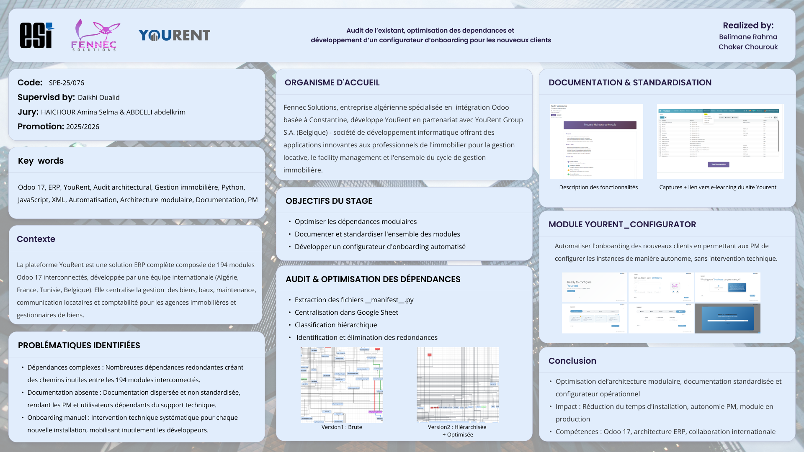
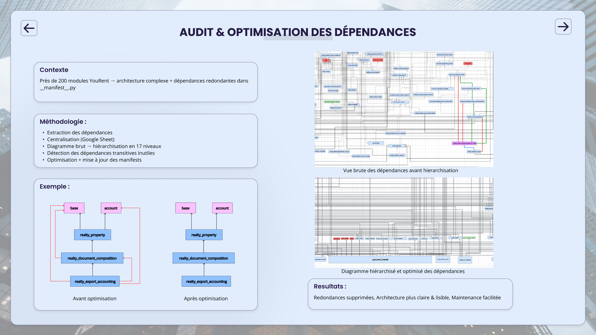
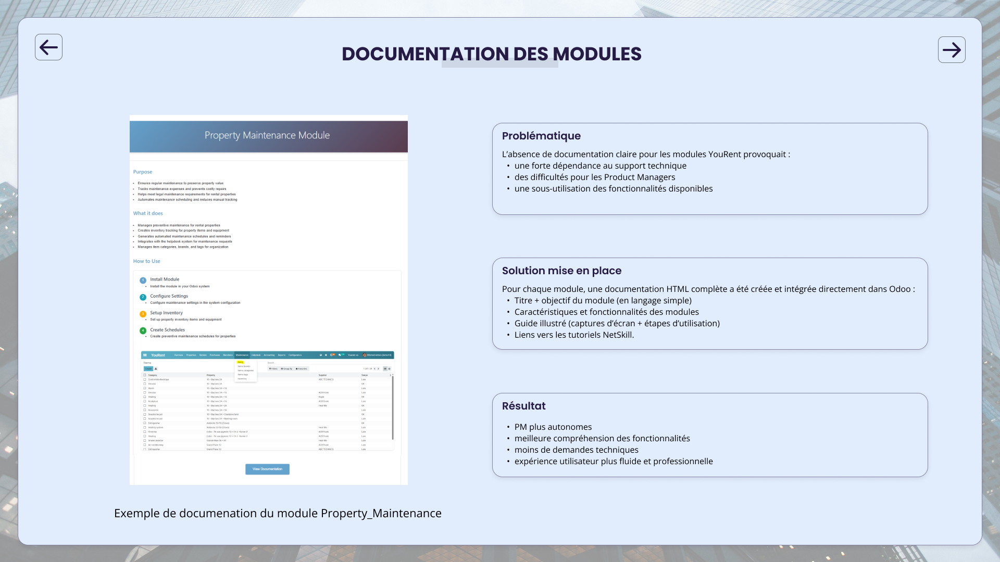
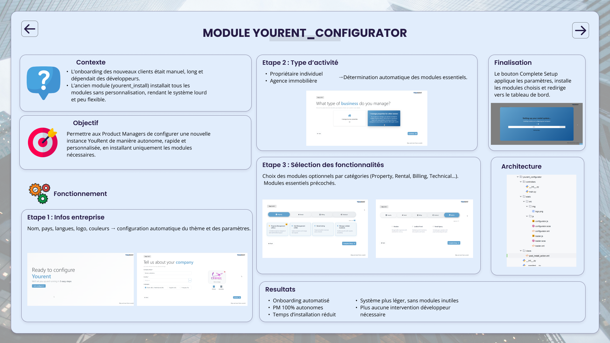
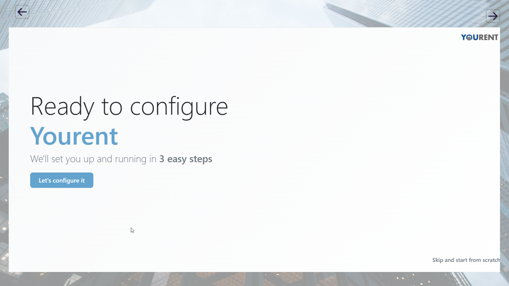
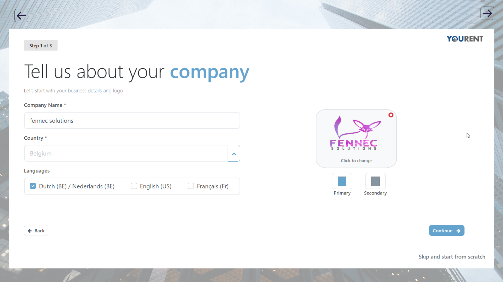
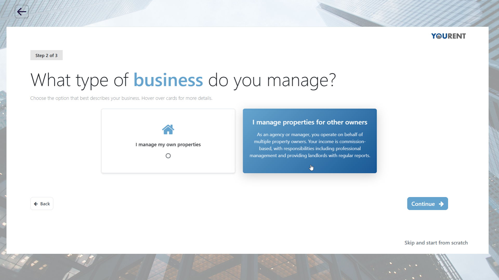
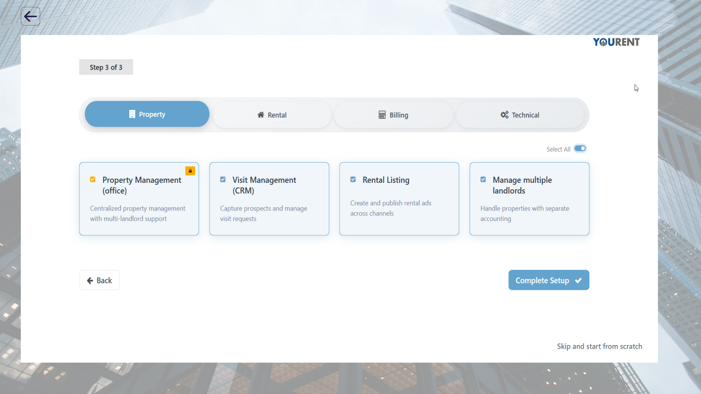
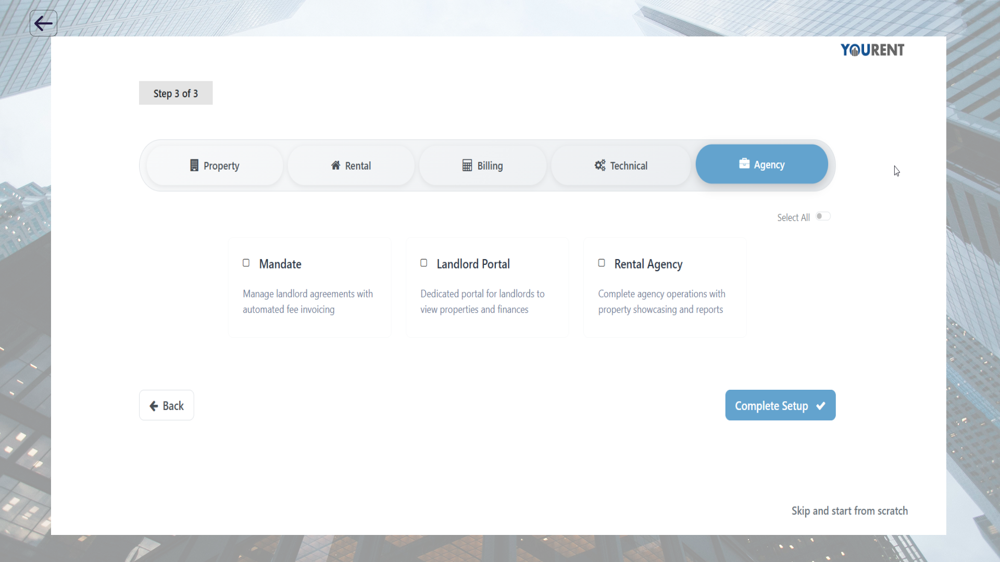
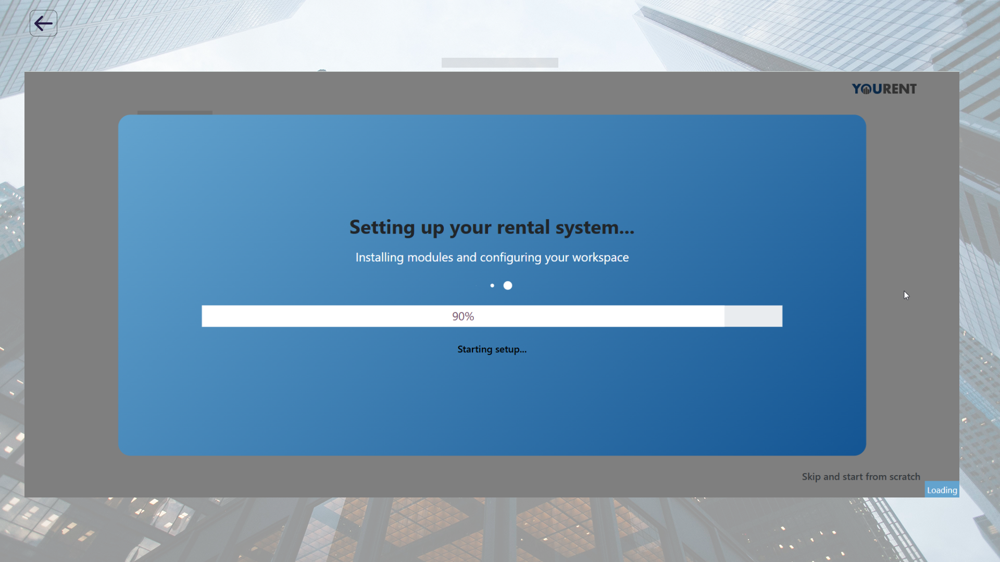

# YouRent Configurator — Odoo 17 Module

> **Internship Project** — Audit de l'existant, optimisation des dépendances et développement d'un configurateur d'onboarding pour les nouveaux clients.

**Realized by:** Chaker Chourouk & Belimane Rahma 
**Supervised by:** Daikhi Oualid  
**Promotion:** 2025/2026 — ESI / Fennec Solutions / YouRent Group S.A.

---

## About

The **YouRent Configurator** is an Odoo 17 module that automates the onboarding of new clients on the YouRent real estate management platform. It replaces the old manual installation process (which required developer intervention) with an interactive 3-step wizard that allows Product Managers to configure instances autonomously.

### Key Features

- **Step 1 — Company Info:** Configure company name, country, languages, logo, and theme colors.
- **Step 2 — Business Type:** Choose between *individual property owner* or *real estate agency*, which automatically determines the essential modules.
- **Step 3 — Feature Selection:** Pick optional modules by category (Property, Rental, Billing, Technical, Agency) with essential modules pre-checked.
- **Automated Setup:** Installs selected modules, applies configuration, and redirects to the dashboard.

---

## Internship Poster

### Overview



### Audit & Dependency Optimization



### Module Documentation



### Module yourent_configurator



### Welcome Screen



### Step 1 — Company Information



### Step 2 — Business Type Selection



### Step 3 — Feature Selection (Property)



### Step 3 — Feature Selection (Agency)



### Setup in Progress



---

## Internship Report

The full internship report is available in the [`Report/`](Report/) folder.

---

## Module Structure

```
yourent_configurator/
├── __manifest__.py
├── __init__.py
├── controllers/
│   ├── __init__.py
│   └── main.py
├── static/
│   └── src/
│       ├── img/
│       └── js/
│           ├── configurator.js
│           ├── configurator.xml
│           ├── loader.js
│           └── loader.xml
├── views/
│   └── post_install_action.xml
├── Poster/            # Internship poster images
├── Report/            # Internship report (PDF)
└── README.md
```

## Technical Details

| Field       | Value                              |
|-------------|------------------------------------|
| Name        | Your Rent Configurator             |
| Version     | 1.0                                |
| Category    | Technical/Base                     |
| Depends     | `base`, `web`                      |
| Author      | YouRent Group S.A.                 |
| Website     | http://www.yourent.immo            |
| Platform    | Odoo 17                            |
| Auto Install| Yes                                |

## Context

The YouRent platform is a complete ERP solution composed of ~194 interconnected Odoo 17 modules, developed by an international team (Algeria, France, Tunisia, Belgium). It centralizes property management, rentals, maintenance, communication, and accounting for real estate agencies and property managers.

### Internship Objectives

1. **Dependency Audit & Optimization** — Extract, centralize, hierarchize, and clean redundant dependencies across all 194 modules.
2. **Module Documentation** — Create standardized HTML documentation integrated directly into Odoo for each module.
3. **Onboarding Configurator** — Develop this `yourent_configurator` module for automated client onboarding.

---

## License

OEEL-1 (Odoo Enterprise Edition License)
